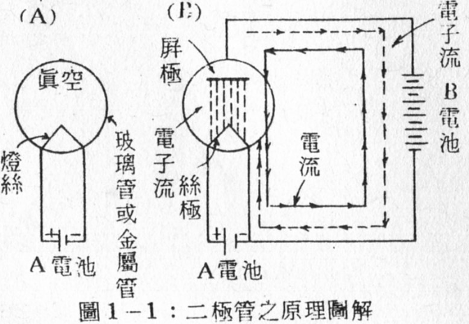
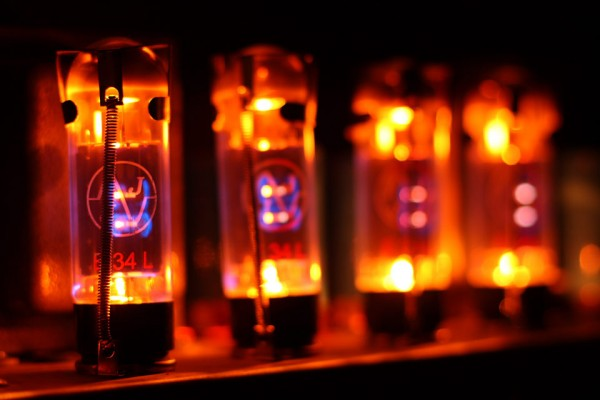

# 真空管的動作原理
## 熱電子放射 
我們在普通物理學中學過，一切物質中的原子係由帶正電的原子核和帶負電的電子集合而成。而物體中有絕緣體和導體之分。絕緣體中的電子不能移動，而導體外表的電子則具有容易移動的性質。這種容易移動的電子稱為**自由電子**。自由電子如果受到外力作用，例如加以熱量，便很容易從導體外表脫離的。
如果從原物質的狀態中，不加外力作用，想取出自由電子是很難的， 但是假如將物質加熱後，再取出自由電子就比較容易。例如由水中不加外力作用想取出水的分子是不可能的，但是如果將水加熱至沸點，水則蒸發，由水面到空間，水分子便陸續地飛出來。如果在空氣壓力少的地方加熱時，更容易蒸發。
電子也是一樣的，如果將導體加熱，導體中自由電子的運動速度，就隨導體的溫度而變化。溫度愈高，自由電子的運動愈活躍。如導體的溫度愈上昇，則電子的速度愈增大，及至達到某高熱時，電子必自導體表面放射出外部。尤其是在真空中加熱，電子更易發射。這種現象稱為`熱電子放射(Thermionic emission of electron)`。真空管的動作原理就是利用這個電子放射的現象來做基礎的。

## 真空管的動作原理 
### 空間電荷
如圖1-1所示，將燈絲裝入真空的破璃管或是金屬管內，並在燈絲的兩端，接入一電池，令燈絲通電加熱至適當的溫度，則燈絲的表面就放射出很多的電子。這許多電于散佈在管內燈絲附近的空問，稱之謂`空間電荷（Space charge)`。

### 順向通路
又如圖(B)所示，另在燈絲上面裝置一金屬板。再加入一電壓比較高的電池，將這個電池的(+)端接至金屬板上，而(-)接至登斯的任一端。此時在管內由燈絲放射出來的電子必開始流動。
因為電子本身是帶負電(-)，而供給在金屬板上的電是帶正電(+)，根據*異性相吸*的原理，此時帶負電的電子必被帶正電的金屬板所吸引。被吸引的電子的途徑是從燈絲到金屬板，經由B電池再回到燈絲，構成一個通路。
### 電流與電子流
這一種電子的流動在學術上稱為`電子流`。但是我們都已知道**電流所假定的方向是和電子流方向是相反的**，所以我們也可以說電流是從 B電池的正極經由金屬板，流到燈絲，再流同B電池。如圖(B)所示的實線是表示電流的方向，虛線表示電子流的方向。但是我們在解釋真空管的動作及特性時，原則上還是以電流的方向為標準。
### 反向開路
其次如將B電池的接線反接，即將B電池的(-)極接在金屬板上，(+)極接在燈絲上，則因金屬板上帶負電(-)，和電子所帶的(-)電是同性，根據*同性相斥*的原理，此時金屬板不能吸引電子，所以電子不能到達金屬板，因電子不能流動，也就是電流不能流通。
根據這個現象可以說真空管的動作原理具有`單向特性(Unidirectional Characteristic)`。
### 絲極與屏極
真空管所用的燈絲通常為`絲極(Filament)`有時稱為發熱體(Heater)。
真空管中所用的金屬板通常稱為屏極或板極(Plate)，有時亦稱陽極(Anode)。
絲極是用來加熱同時兼任放射電子的功能，絲極所需的電源稱為A電，或稱絲極電壓，通常用`E`符號表之。**絲極電壓用低壓的直流或交流電壓來供給**。
`屏極`在真空管中擔任吸引電子的功用，其所需要的電壓電源稱為B電，或稱屏壓(Plate voltage)，通常用`Ep`符號表示。**屏壓必須是純直流電**方可使用，交流電或是不純粹的直流電(指脈動直流)，不適合使用於屏壓。

## 習題 
1. 何謂熱電子放射?
2. 真空管的動作原理是以什麼做基礎?
3. 真空管中為什麼要真空?
4. 何謂空間電荷?
5. 絲極在真空管中擔任什麼工作?
6. 屏極在真空管中擔任什麼工作?
7. 負電接至屏極為什麼不能吸收電子?
8. 何謂真空管的單向性?

--------
END

