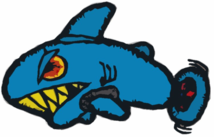
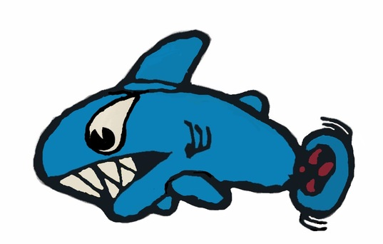
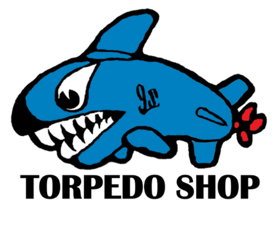
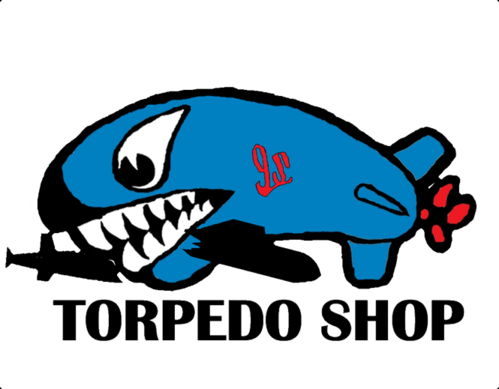
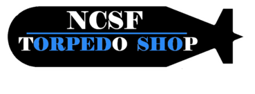
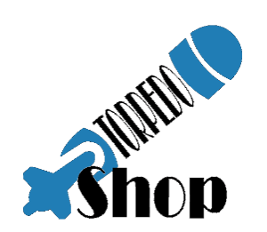
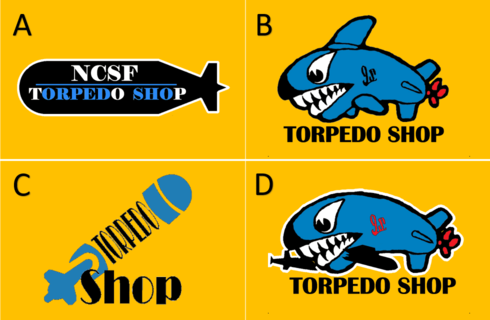

# 前言
2020年為公司40週年紀念，經過同仁討論，在大家都有興趣且配合小弟的任性下，第一次設計徽章，因為沒啥繪圖軟體的經驗，用了`小畫家`跟`GIMP`作畫。

# 第一版
初始的第一版是參考MK-44魚雷。

# 第二版
經夫人審查，她覺得太兇了，要**溫和一點**，所以又融合AN/SLQ-48載具 *黑鼻子、太極眼及沙魚齒* 的特徵。
這是AN/SLQ-48除雷載具。

第二版的樣子

# 第三版
給同仁看，同仁建議後面藍藍一圈很多人不知道是甚麼，可以改成只有車葉的樣子，魚鰓也變形成`9S`的字樣。

# 第四版
同仁建議要更像魚雷一點，看看魚鰭拿掉會不會好一點，最好嘴巴還可以**咬一艘敵人的潛艦**。
敵人潛艦的樣子

拿掉魚鰭，咬潛艦的。

# 加碼
另外又設計了文字的LOGO。

部門的柴女妹妹(真的，她姓柴)也幫忙貢獻了一個給大家選。

# 票選
最後四個方案給同仁選擇，印在衣服前面胸前小徽，衣服後面大圖，及紀念帽的圖徽。

票選結果\

圖樣 | 胸前小徽 | 背後大圖 | 紀念帽樣式 |
:---:| :-----: | :------: | :--------:| 
A    |   V     |          |           |
B    |         |          |V          |
C    |         |          |           |
D    |         |    V     |           |
--------
END
