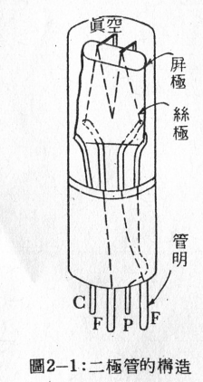
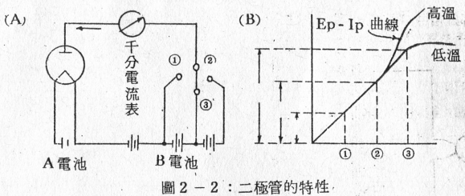
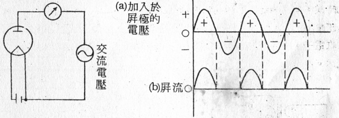
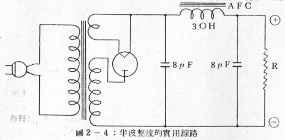
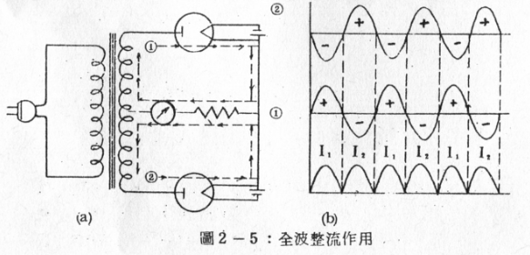
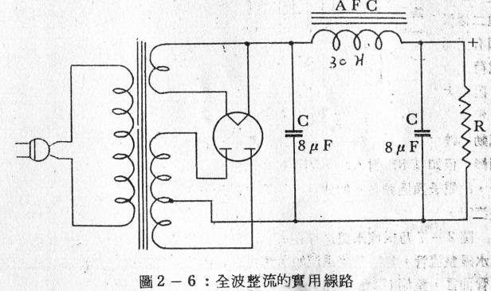
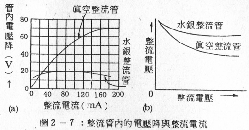

# 二極管的構造和種類
## 二極管的構造和特性
如圖2-1所示真空管的構造，是由包含一個能放射電子的絲極和一個吸引電子的屏極所構成。凡僅由絲極和屏極兩極組合而成的真空管稱為`二能極真空管(Two electrode tube)，簡稱二極管（Diode）`。

又如圖2-2 (A)所示，在二極管中的絲極兩端接入A電池，繼續加熱，令其放射電子。又在屏極和絲極間接入B電池和一只千分電流表(Miliam meter)，此時如果B電池的(+)端接向屏極時，從B電池則有依箭頭方向的電流流出。

這種電流動態由千分電流表上觀察，則可一目瞭然。此種在屏極電路流通的電流稱為`屏流(Plate current)，通常以Ip符號表示`。如果在屏極上的電壓越高，則屏極上所吸收的電子也越多，因此屏流也越增大。即如圖2-2 (B)所示，屏壓漸次依123增高，而屏流也相應地依 1, 2, 3增加。但到達某一定值時，如再增加屏壓，屏流也不會再增加，也就是達到所謂飽和狀態。在這個飽和狀態下的屏流稱為`飽和屏流`。

這是因為在絲極的一定溫度之下，放射出來的電子數目是有限定的，故此時的屏流又稱為溫度限制電流。但若增高絲極溫度時 ，電子放射也增多，同時屏流也增加。

其次若將B電池反接，在屏極上加入(-)電壓時，屏流即完全不有流通。如此可以用**屏壓和屏流的關係以曲線來表示二極管的特性**，這曲線稱為二極管的特性曲線，簡稱`Ep – Ip曲線`。(註: Ep = 屏壓，Ip = 屏流)

又如圖2-3所示，在屏極和絲極間加入如(a)的交流電壓時，當屏極供給以(+)半波時便有電流流過，反之，如屏極供給以(-)半波時， 則無電流通過。屏流如圖(b)所示，每隔半週流動一次。因此利用此種特性，可以將圖(a)的交流變為如圖(b)的脈動屏流。這個原理常使用於交流電壓的整流方式。

## 二極管的種類
### (1)半波整流管：
如前所述，將加於屏極的交流電壓取出一半屏流的整流方式如圖2- 3所示者稱為半波整流(Half wave rectification)，而擔任半波整流工作的真空管稱為`半波整流管(Half wave tectifier)`。半波整流管通常都是由一只單屏二極管構成的。圖2-4便是表示半波整流的實用電路。

### (2)全波整流管：
如圖2-5(a)所示，使用兩只半波整流管接在具有中心抽頭的電源變壓器兩端上，如此接法則當交流電壓的正半波(+)供給到①二極管屏極的時候，②二極管的屏極同時得到負半波(-)。此時在①屏極上的電壓示正壓(+)，而在②屏極上的電壓是負壓(-)，因此，只有①屏極能吸收電子，所以有屏流I1流通，而②屏極無法吸收電子，所以沒有屏流流通。

又當交流電反向時，電壓供給的情形正和前相反，此時正半波(+)供給2屏極，而負半波(-)供給到1屏極，所以此時輪到2屏極有屏流I2流通，而1屏極便無屏流通過。
**如此1和2兩只二極管輪流擔任整流工作，把交流電壓的上下兩半週都加以整流，其整流前後的波形如圖(b)所示，這種整流方式稱為全波整流(Full wave rectification)**。但為使用方便起見，將二組二極管一起封裝入一只玻璃管內，這種裝置的真空管稱為`全波整流管（Full wave rectifier）`。利用全波整流管的實用線路如圖2-6所示。

### (3)水銀蒸氣整流管：

在普通的二極管，從絲極放射出來的熱電子不能完全到達屏極，有一部份電子因為互相反斥作用，失去它的速度，而在屏極與絲極間漂游，這種漂流的電子稱為空間電荷(Space charge)。即因帶負電的電子群散佈在絲極的附近，所以從**絲極放射出來的熱電子受到空間電荷的反斥力作用 ，而造成妨害熱電子放射的結果。**
若在二極管內封入少量的水銀時，當絲極一加熱，則管內的溫度上昇，水銀亦隨之而蒸發，於是管內便充滿水銀的蒸氣。此時如屏極加入正電壓，則從絲極放射出來的電子便向上面突進，，因此`水銀的分子即被分解為正負電荷二種的微粒子(離子)，這種作用稱為電離化`，但由電離作用所發生的離子中，帶正電的離子和帶負電的空間電荷引起中和作用，於是便可消滅空問電荷，以防止它對於熱電子放射之妨礙。

換言之，即**普通二極管因有空間電荷之故，阻力大，電子之流動比較困難，但如以水銀封入時，因沒有空問電荷存在，所以管內的阻力因而減少·，故電子通過較易**。如此凡二極管內封入有水銀蒸氣者，則稱為`水銀蒸氣整流管`。

圖2-7乃根據水銀之存在與否而判定整流特性的不同，即如(a)圖，在水銀整流管，無論整流電流如何變化，管內電壓降不變。對普通真空整流管而言，整流電流愈增加，管內電壓降也愈增大。這兩種整流管對整流電流和電壓的關係如圖(b)所示，即在普通整流管中，整流電流愈增加，整流電壓便愈減少，但在水銀整流管中幾乎保持一定，並無多大改變。

習題二 
- (1)試述二極管的構造。
- (2)何謂半波整流?何謂全波整流? 
- (3)試述全波整流管的構造。
- (4)試述水銀整流管的動作原理和它的特點。
- (5)何謂二極管的特性曲線?

--------
END

